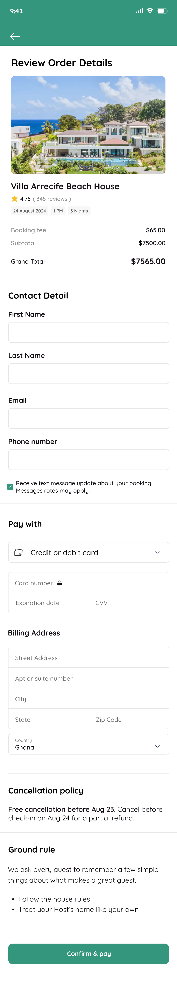

# 🧭 Introduction to Wireframing

## What is Wireframing?

Wireframing is a **crucial step in the design process**, serving as the **blueprint or skeletal framework** of a website or application.  
It outlines the **basic structure, layout, and flow** of a digital product without focusing on detailed design elements such as colors, fonts, or images.  
A wireframe helps visualize how users will interact with the interface by showing the placement of elements, navigation paths, and content hierarchy.

## Importance of Wireframing in the Design Process

Wireframing plays a vital role in bridging abstract ideas and practical implementation. Here’s why it’s important:

1. **Clarifies Ideas and Concepts**  
   Translates abstract ideas into tangible visual representations, allowing stakeholders to understand the overall structure early in the process.

2. **Facilitates Communication**  
   Acts as a communication tool between designers, developers, and clients, ensuring everyone is aligned on layout and functionality.

3. **Identifies Usability Issues**  
   Helps uncover navigation problems, information hierarchy issues, and user flow challenges before visual design or coding begins.

4. **Saves Time and Resources**  
   Detecting and fixing design flaws early reduces costly revisions during later stages of development.

5. **Guides the Design and Development Phases**  
   Serves as a roadmap for designers and developers to build the final product efficiently, ensuring consistency and user-centered design.

---

## 🧩 Key Elements of Wireframing

Wireframes consist of several key elements that define how a user interacts with a page or application.  
Each element contributes to the **overall usability**, **structure**, and **clarity** of the design.

### 1. **Layout Structure**

Defines the **arrangement of elements** on a page — how content, buttons, images, and navigation are positioned.  

- 🧠 *Purpose:* Provides a visual hierarchy and ensures that users can easily find important information.  
- 💡 *Example:* A travel website might place the search bar prominently at the top of the homepage, while listings appear in a grid layout below.

### 2. **Navigation**

Shows how users **move between pages or sections** of a site or application.  

- 🧠 *Purpose:* Ensures intuitive flow and accessibility throughout the product.  
- 💡 *Example:* A consistent top navigation bar allows users to access “Home,” “Bookings,” and “Profile” sections easily.

### 3. **Content Placement**

Indicates **where text, images, videos, and other media** will appear.  

- 🧠 *Purpose:* Helps prioritize important information and maintain readability.  
- 💡 *Example:* On an e-commerce site, product images may occupy the left side of the page while descriptions and “Add to Cart” buttons are on the right.

### 4. **Functionality**

Outlines the **interactive elements and features** that define user behavior.  

- 🧠 *Purpose:* Demonstrates how users will interact with components like forms, buttons, sliders, or modals.  
- 💡 *Example:* A login form wireframe includes input fields, a “Remember Me” checkbox, and a “Sign In” button to visualize how the interaction will work.

---

## 🛠 Tools for Wireframing

Popular tools include:

- **Figma**
- **Adobe XD**
- **Sketch**
- **Balsamiq**

Among these, **Figma** is widely preferred for its **collaborative**, **browser-based**, and **easy-to-share** environment.

---

## 🧭 Types of Wireframes

Wireframes are essential visual guides that outline the structure and layout of a digital product (such as a website or mobile app). They help teams visualize user flow, placement of elements, and functionality before moving into the detailed design or development stage.

---

### 🧩 **1. Low-Fidelity Wireframes**

**📝 Description:**
Low-fidelity (Lo-Fi) wireframes are simple sketches or rough layouts that capture the basic structure and flow of an interface. They prioritize **content placement and user flow** over color, typography, or branding.

**🎯 Purpose:**
Used in the **early stages** of the design process to explore ideas quickly, validate user journeys, and gather early feedback.

**🔍 Key Characteristics:**

- Simplified boxes, placeholders, and text labels
- No color or detailed typography
- Focused on layout, hierarchy, and navigation
- Created using tools like Balsamiq, Figma (wireframe mode), or even pen and paper

**🕒 When to Use:**
During brainstorming, ideation, and initial UX discussions before committing to design details.

---

### 🎨 **2. High-Fidelity Wireframes**

**📝 Description:**
High-fidelity (Hi-Fi) wireframes are detailed, polished representations that **closely resemble the final product**. They include realistic visuals, brand colors, images, and often simulate user interactions.

**🎯 Purpose:**
Used in the **later stages** of the design process to test usability, finalize layouts, and prepare for developer handoff.

**🔍 Key Characteristics:**

- Realistic content, images, icons, and branding
- Defined colors, fonts, and spacing
- Interactive elements (buttons, forms, dropdowns)
- Pixel-perfect alignment and visual hierarchy

**🕒 When to Use:**
During usability testing, client presentations, and final design approvals before development.

---

## 🖼️ Wireframe Type in This Example

The image provided — **“Review Order Details” screen** — represents a **High-Fidelity Wireframe**.

**💡 Reasoning:**

- Uses **real product imagery** (Villa Arrecife Beach House).
- Contains **branded colors, styled fonts**, and **interactive UI elements** (buttons, form fields, dropdowns).
- Displays **realistic layout and hierarchy**, suitable for presentation or development handoff.
- Reflects the **final user experience** design rather than a conceptual sketch.

---

✅ **Conclusion:**
This is a **High-Fidelity Wireframe**, typically used in the **final design phase** before implementation — ideal for developer collaboration, usability testing, and stakeholder review.
